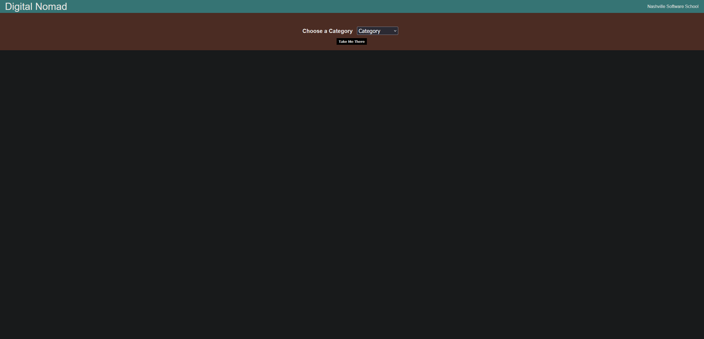
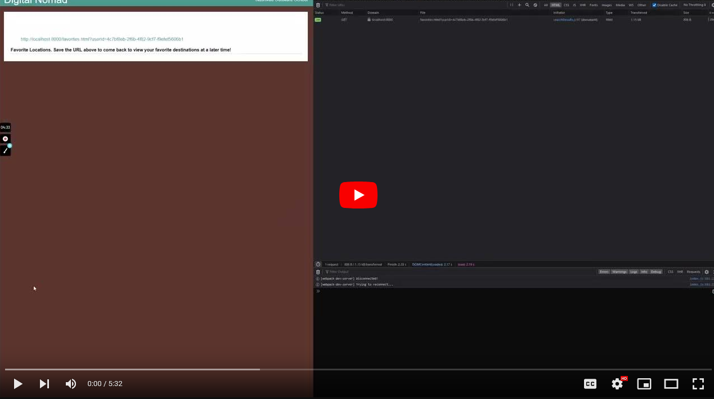

<!-- PROJECT LOGO -->
 

    

<h3 align="center">Digital Nomad</h3>

  

    Find Your Destination
     
  

___

## Synopsis

Digital Nomad is a group project at Nashville Software School within the Software Engineering Program Cohort #1. Contributors to this project include Alex Murillo, Erika Smith, Matt Marotta, and Steve Winters.

Digital Nomad is a service that allows users to search for travel destinations based on criteria such as access to beaches, night life, etc. Users are then provided a list of potential destinations, which they can then save for later viewing at a provided URL.

---

## Lessons Learned

Concise and detailed initial planning will pay dividends. Particularly if the project planning is well thought out. This will help avoid future confusion and the need to reinvent the wheel. This also speaks to breaking down tasks into manageable pieces.

While I did have some limited experience, the front end work was challenging in a good way, and helped to further develop my skills in that area. The experience I had with Java also helped me understand Javascript with its similar syntax.

I also discovered that it may be best to have team members focus on particular areas as opposed to switching roles. I feel we may have been more efficient had we "specialized" in certain areas.

---

## Build Tools

* </a>
* </a>
* </a>
* </a>
* </a>
* </a>
* </a>
* </a>
* </a>

—

## View This Project

View this project: <a href="https://youtu.be/dHkNxV84Lhk"><b>here<b></a>.

---

## Contact

Alex Murillo - alex.d.murillo@protonmail.com
 

